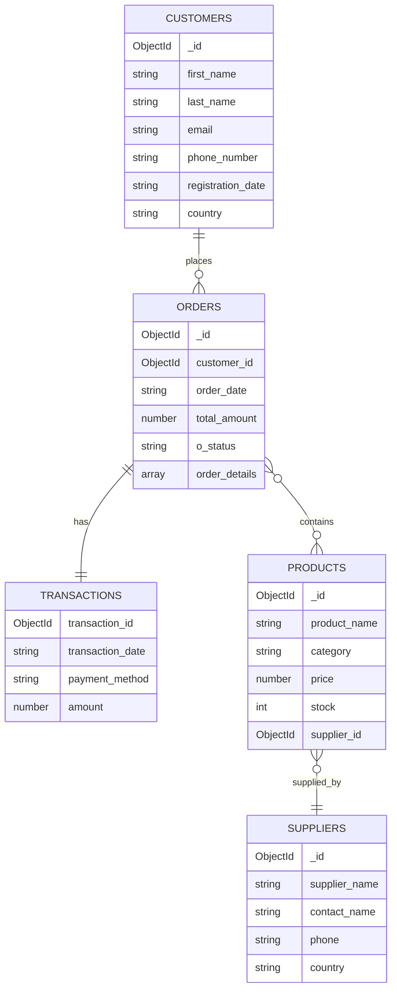

# ERD and relationship notes

## Relationship summary

- `customers` to `orders`: 1:N
- `orders` to `transactions`: 1:1
- `orders` to `products`: many-to-many via `order_details`
- `products` to `suppliers`: N:1

## Relationship rationale

- `customers` and `orders` are modeled as 1:N because one customer can place many orders.
- `orders` and `transactions` are modeled as 1:1 because each order has a single payment record in the application workflow.
- `orders` and `products` are many-to-many through `order_details`, which stores line-item quantity and price data.
- `products` to `suppliers` is N:1 because many products can be supplied by one supplier.

## Design note

The application does not duplicate product names into each order line, because historical order records should remain stable even if catalog data later changes.
